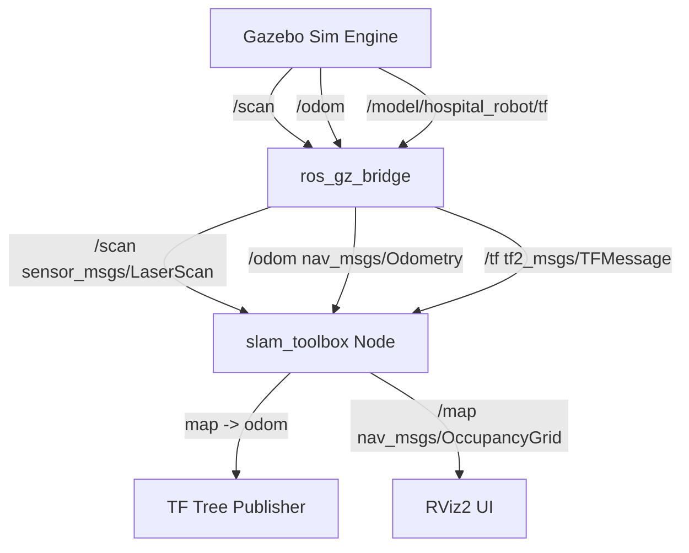

# Technical Documentation: SLAM Integration

This document describes the technical architecture and interface mapping for the autonomous hospital spill cleaning robot's SLAM module.

---

## 1. SLAM Architecture Overview

The robot uses the `slam_toolbox` package in **online asynchronous mapping mode**. This mode processes scan data as it arrives, building a pose-graph and solving constraints via Google's **Ceres Solver** to optimize the map and estimate the robot's trajectory in real-time.



---

## 2. ROS 2 Coordinate Frames (TF Tree)

The transform hierarchy is critical for 2D SLAM. The map-to-sensor chain is established as follows:

1. **`map` (Global Frame)**: Published by the `slam_toolbox` node; represents the origin of the generated occupancy grid.
2. **`odom` (Odometry Frame)**: Published by the `slam_toolbox` node as the parent of `base_link` representing odometry drift correction.
3. **`base_link` (Robot Base)**: Broadcasted via the odometry translation and rotation data.
4. **`lidar_link` (LiDAR Frame)**: Rigid static transform published by `robot_state_publisher` based on URDF parameters.
5. **`camera_link` (Camera Frame)**: Rigid static transform published by `robot_state_publisher` based on URDF parameters.

### Current Valid TF Tree Verification
```
map
 └── odom
      └── base_link
           ├── lidar_link
           └── camera_link
```

---

## 3. Active Nodes and Topics List

### ROS Nodes
* `/slam_toolbox`: Lifecycle node executing the Ceres pose-graph optimization, map generation, and correcting odometry drift.
* `/robot_state_publisher`: Reads the URDF file and publishes `/tf_static` links.
* `/ros_gz_bridge`: Bridges simulator topics (scans, camera, tf, and odom) to ROS 2 topics with manual frame overrides.
* `/rviz2`: Display interface displaying map, scans, and robot TF tree.

### ROS Topics
| Topic Name | Message Type | Publisher Node | Subscriber Node | Description |
| :--- | :--- | :--- | :--- | :--- |
| `/scan` | `sensor_msgs/msg/LaserScan` | `/ros_gz_bridge` | `/slam_toolbox`, `/rviz2` | 2D LiDAR range measurements (Frame: `lidar_link`) |
| `/odom` | `nav_msgs/msg/Odometry` | `/ros_gz_bridge` | `/slam_toolbox`, `/rviz2` | Wheel odometry velocity and position |
| `/cmd_vel` | `geometry_msgs/msg/Twist` | User/Controller | `/ros_gz_bridge` | Commands robot linear and angular velocity |
| `/map` | `nav_msgs/msg/OccupancyGrid` | `/slam_toolbox` | `/rviz2` | 2D Grid map of the hospital |
| `/tf` | `tf2_msgs/msg/TFMessage` | `/ros_gz_bridge`, `/slam_toolbox` | `/rviz2` | Dynamic transforms (e.g. `map`->`odom`->`base_link`) |
| `/camera/image_raw` | `sensor_msgs/msg/Image` | `/ros_gz_bridge` | User/Capture script | RGB camera stream (Frame: `camera_link`) |

---

## 4. Key Configuration Parameters (`mapper_params_online_async.yaml`)

- **`solver_plugin`**: `solver_plugins::CeresSolver`
- **`ceres_linear_solver`**: `SPARSE_NORMAL_CHOLESKY` for optimal performance in 2D graphs.
- **`scan_topic`**: `/scan`
- **`odom_frame`**: `odom`
- **`map_frame`**: `map`
- **`base_frame`**: `base_link`
- **`resolution`**: `0.05` (5cm cell resolution)
- **`max_laser_range`**: `10.0` (matching URDF physical specifications)
